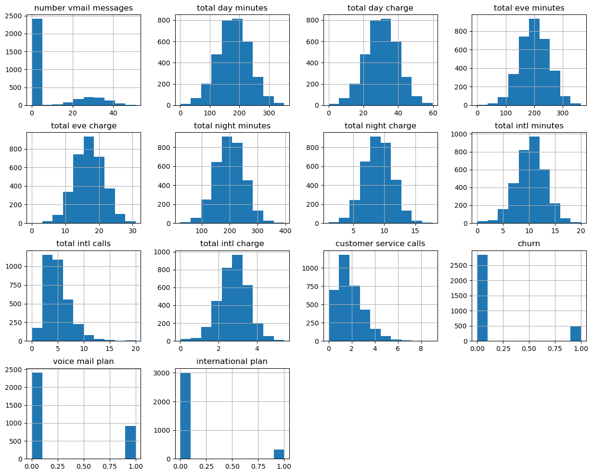

#  SyriaTel Customer Churn
### Author: George Opondi
---

## Overview
The objective of this project is to develop a robust classifier capable of predicting customer churn for SyriaTel, a telecommunications company. Customer churn prediction entails identifying customers who are likely to discontinue their services with the company in the near future. The task is framed as a binary classification problem, where the classifier will categorize customers into two groups: those expected to churn and those likely to remain.

---

## Business problem
The primary business challenge facing SyriaTel, a telecommunications company, is the need to minimize customer churn to maintain sustainable growth and profitability. High rates of customer churn can adversely affect revenue streams and erode market competitiveness. To address this challenge, SyriaTel must implement proactive strategies to identify customers at risk of discontinuing their services and effectively engage them with targeted retention initiatives. By leveraging advanced analytics and predictive modeling techniques, the company can develop a comprehensive understanding of customer behavior patterns and preferences, enabling them to tailor retention efforts and maximize customer satisfaction. 

Therefore, the goal of the project is to develop and deploy a robust classifier capable of accurately predicting customer churn for SyriaTel, enabling the company to proactively identify customers at risk of discontinuing their services. This classifier will assist SyriaTel in implementing targeted retention strategies to minimize churn, thereby maximizing customer retention, optimizing revenue streams, and ensuring sustainable business growth. Through a strategic focus on customer retention, SyriaTel can foster long-term relationships with its clientele, enhance brand loyalty, and ultimately drive business success in a competitive marketplace.

---

## Data Understanding

### Details on the data set

### Title: SyriaTel Customer Churn
Relevant information: This data set is used to predict customer churn based on the variables/columns available. The churn column is therefore the target variable.

In this dataset, there are 3333 unique rows and  21 independent predictive variables or column attributes.

### Sources:
 a) This data set is obtained from Kaggle
 
 b) (https://www.kaggle.com/datasets/becksddf/churn-in-telecoms-dataset)

### Description of columns
- _state_ : The state of the customer.
- _account length_ : The length of the account in days or months.
- _area code_ : The area code of the customer's phone number.
- _phone number_ : The phone number of the customer.
- _international plan_ : Whether the customer has an international plan or not
- _voice mail plan_ : Whether the customer has a voicemail plan or not
- _number vmail messages_ : The number of voicemail messages the customer has.
- _total day minutes_ : Total minutes of day calls.
- _total day calls_ : Total number of day calls.
- _total day charge_ : Total charge for the day calls.
- _total eve minutes_ : Total minutes of evening calls.
- _total eve calls_ : Total number of evening calls.
- _total eve charge_ : Total charge for the evening calls.
- _total night minutes_ : Total minutes of night calls.
- _total night calls_ : Total number of night calls.
- _total night charge_ :  Total charge for the night calls.
- _total intl minutes_ : Total minutes of international calls.
- _total intl calls_ : Total number of international calls.
- _total intl charge_ : Total charge for the international calls.
- _customer service calls_ : Total charge for the international calls.
- _churn_ : Whether the customer churned or not (True/False).

---

## Visualizations

